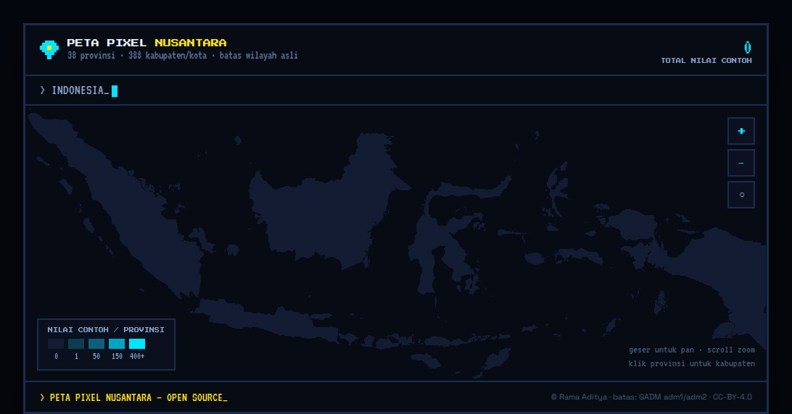

# Peta Pixel Nusantara - Peta Indonesia 8bit

**Peta Indonesia 8bit** yang bisa di-zoom dari 38 provinsi ke 519
kabupaten/kota. Boundary asli Indonesia dirasterisasi menjadi grid pixel, lalu
dirender dengan canvas nearest-neighbor supaya tetap tajam, ringan, dan mudah
dipakai ulang di web, mobile, game engine, atau tool internal.

In English: an **8-bit map of Indonesia** and **pixel map of Indonesia** with
province and ADM2 coverage, packaged as open-source data plus a vanilla
JavaScript interactive demo.




## Why This Exists

Peta ini dibuat untuk [aiclub.id](https://aiclub.id): komunitas AI gratis
se-Nusantara yang ingin menampilkan persebaran builder per provinsi dan kota
tanpa kehilangan rasa visualnya.

Tile map biasa terlalu halus, bergantung jaringan, dan tidak cocok dengan
estetika pixel. Di sini, batas wilayah administratif Indonesia diubah menjadi
grid pixel yang bisa dibaca seperti data biasa.

Hasilnya adalah peta yang:

- bekerja offline setelah file dimuat;
- tajam di zoom berapa pun;
- punya hit-test O(1) lewat indeks grid;
- mudah di-port ke platform apa pun yang bisa menggambar persegi;
- aman untuk data komunitas karena dirancang untuk angka agregat, bukan data personal.

## Use Cases

Pakai repo ini kalau kamu butuh:

- peta Indonesia 8bit untuk landing page, komunitas, dashboard, atau game;
- pixel map of Indonesia yang tetap tajam saat zoom;
- interactive Indonesia map tanpa tile server;
- data grid provinsi + kabupaten/kota Indonesia untuk canvas renderer;
- contoh rasterizer GeoJSON/TopoJSON menjadi pixel grid;
- base map agregat untuk komunitas, event, populasi, chapter, atau coverage.

## Demo

Buka langsung:

```bash
open index.html
```

Atau jalankan server statis kecil kalau browser kamu membatasi akses file lokal:

```bash
python3 -m http.server 8080
```

Lalu buka `http://localhost:8080`.

Tidak ada build step, framework, bundler, atau backend. Demo ada di
[index.html](index.html), data siap pakai ada di
[data/peta-hd-data.js](data/peta-hd-data.js) dan
[data/peta-hd-data.json](data/peta-hd-data.json).

## What You Get

| Layer | Coverage | Runtime format |
| --- | --- | --- |
| Province | 38 provinsi Indonesia | `prov[]` + `provRle` |
| Regency / city | 519 ADM2 units from geoBoundaries | `kab[]` + `kabRle` |
| Relationship | kabupaten/kota ke provinsi induk | `kab[].p` + `provKab` |
| Geometry metadata | bbox, centroid, luas sel | included per region |

Interaksi demo:

- hover untuk tooltip;
- klik provinsi untuk zoom ke kabupaten/kota;
- pan dengan drag;
- zoom dengan scroll atau tombol;
- tekan `Esc` untuk kembali bertahap.

## Quick Start

Gunakan versi browser:

```html
<script src="./data/peta-hd-data.js"></script>
<script>
  const mapData = window.PETA_HD;
  console.log(mapData.prov.length); // 38
  console.log(mapData.kab.length);  // 519
</script>
```

Atau pakai JSON murni:

```js
import fs from "node:fs";

const mapData = JSON.parse(fs.readFileSync("data/peta-hd-data.json", "utf8"));
```

Regenerasi data:

```bash
node tools/rasterize.mjs
```

Ubah lebar grid kalau butuh resolusi berbeda:

```bash
node tools/rasterize.mjs 2000
```

## Data Format

`window.PETA_HD` berisi metadata region dan dua grid yang dikompresi dengan
run-length encoding.

```jsonc
{
  "W": 1600,
  "H": 594,
  "lonMin": 95.01,
  "lonMax": 141.02,
  "latMin": -11.01,
  "latMax": 6.08,

  "prov": [
    {
      "n": "Aceh",
      "m": 0,
      "a": 1234,
      "x0": 0,
      "y0": 0,
      "x1": 100,
      "y1": 80,
      "cx": 50,
      "cy": 40
    }
  ],

  "kab": [
    {
      "n": "Semarang",
      "t": "Kota",
      "p": 13,
      "a": 120,
      "x0": 0,
      "y0": 0,
      "x1": 30,
      "y1": 20,
      "cx": 15,
      "cy": 10
    }
  ],

  "provKab": {
    "13": [120, 121, 122]
  },

  "provRle": [255, 8000, 0, 12],
  "kabRle": [65535, 8000, 12, 4]
}
```

Field penting:

- `W`, `H`: ukuran grid pixel.
- `prov[]`: daftar provinsi. Index array adalah ID provinsi.
- `kab[]`: daftar kabupaten/kota. `p` menunjuk ke index provinsi di `prov[]`.
- `provKab`: lookup cepat dari provinsi ke daftar kabupaten/kota.
- `provRle`: grid provinsi. `255` berarti laut.
- `kabRle`: grid kabupaten/kota. `65535` berarti laut.
- `m`: metrik contoh untuk pewarnaan. Isi dengan data kamu sendiri, misalnya
  member, venue, event, atau populasi.

Dekode RLE:

```js
function inflate(rle, size, Ctor) {
  const grid = new Ctor(size);
  let offset = 0;

  for (let i = 0; i < rle.length; i += 2) {
    const value = rle[i];
    const count = rle[i + 1];
    grid.fill(value, offset, offset + count);
    offset += count;
  }

  return grid;
}

const D = window.PETA_HD;
const provinceGrid = inflate(D.provRle, D.W * D.H, Uint8Array);
const regencyGrid = inflate(D.kabRle, D.W * D.H, Uint16Array);
```

Hit-test dari posisi layar ke wilayah:

```js
const gx = Math.floor(view.x + (screenX / screenWidth) * view.w);
const gy = Math.floor(view.y + (screenY / screenHeight) * view.h);
const regionIndex = provinceGrid[gy * D.W + gx];

if (regionIndex !== 255) {
  console.log(D.prov[regionIndex].n);
}
```

## Rendering Notes

Aturan utamanya sederhana: jangan haluskan pixel.

- Canvas 2D: `ctx.imageSmoothingEnabled = false` dan CSS `image-rendering: pixelated`.
- WebGL: gunakan texture sampler `NEAREST`.
- Flutter: `FilterQuality.none`.
- React Native Skia: render grid sebagai image/rect tanpa filtering.
- Unity/Godot: gunakan point filtering atau nearest-neighbor.

Warna default:

```js
const ramp = ["#131C33", "#0E3C50", "#0E607A", "#00A7C4", "#00E5FF"];
```

Untuk data komunitas, simpan angka agregat di `prov[].m` atau mapping eksternal
berdasarkan nama/kode wilayah, lalu bucket-kan ke ramp warna. Peta ini tidak
mengharuskan kamu memakai skema data aiclub.id.

## Keywords

Natural search phrases this project is built around:

- peta indonesia 8bit
- peta indonesia 8 bit
- peta pixel indonesia
- peta pixel nusantara
- indonesia 8-bit map
- indonesia pixel map
- pixel map of indonesia
- interactive indonesia map
- indonesia map geojson
- indonesia adm2 map

## How It Works

Pipeline generator ada di [tools/rasterize.mjs](tools/rasterize.mjs):

1. Decode TopoJSON arcs menjadi ring koordinat WGS84.
2. Hitung shared bounds untuk provinsi dan kabupaten/kota.
3. Rasterisasi polygon ke grid pixel dengan scanline fill.
4. Render provinsi dan kabupaten/kota ke grid yang sama supaya selaras.
5. Assign kabupaten/kota ke provinsi lewat majority vote geografis.
6. Hitung metadata region: area, bounding box, centroid.
7. Kompres grid menjadi RLE dan tulis file data.

Karena runtime hanya membaca grid, hover dan klik tidak perlu point-in-polygon.
Cukup `grid[y * W + x]`.

## Repository Layout

```txt
peta-pixel-nusantara/
├─ index.html
├─ assets/
│  └─ preview.png
├─ data/
│  ├─ peta-hd-data.js
│  └─ peta-hd-data.json
├─ sources/
│  ├─ indonesia-38-provinces.topo.json
│  ├─ geoBoundaries-IDN-ADM2_simplified.geojson
│  └─ indonesia-topojson-city-regency.json
├─ tools/
│  └─ rasterize.mjs
├─ ATTRIBUTION.md
├─ LICENSE
└─ README.md
```

## Data Sources

Please keep attribution when using or redistributing derived data from this repo.

- Province boundaries:
  [denyherianto/indonesia-geojson-topojson-maps-with-38-provinces][prov-src],
  covering 38 provinces under CC-BY-4.0.
- Regency / city boundaries:
  [geoBoundaries][geoboundaries], covering 519 Indonesia ADM2 units under
  CC-BY-4.0.
- Legacy fallback ADM2 source:
  [tvalentius/Indonesia-topojson][kab-src], covering 388 GADM-derived
  regencies/cities. The rasterizer only uses this when the geoBoundaries file is
  not present.

Suggested attribution:

> Peta Pixel Nusantara uses province boundary data from denyherianto's
> Indonesia 38-province TopoJSON dataset and ADM2 boundary data from
> geoBoundaries. Pixel rasterization and demo code by Rama Aditya.

See [ATTRIBUTION.md](ATTRIBUTION.md) for details.

## Current Limitations

The bundled kabupaten/kota layer now uses geoBoundaries ADM2 and contains
519 units. That is more complete than the older GADM-derived fallback, but names
and official codes may still need normalization before use in government-grade
systems.

The rendering format does not need to change to upgrade the data. Replace the
ADM2 source with a newer dataset, normalize the names/codes, then run:

```bash
node tools/rasterize.mjs
```

Good references for future normalization:

- geoBoundaries metadata/API;
- BIG or BPS-compatible administrative boundaries;
- [cahyadsn/wilayah](https://github.com/cahyadsn/wilayah) for official region
  codes and name mapping.

## Privacy

This project is designed for aggregate maps. If you bind community data to the
map, avoid exposing individual records. For small groups, use a privacy
threshold such as `<5` instead of exact counts.

## Contributing

Issues and pull requests are welcome.

Useful contribution areas:

- update the kabupaten/kota dataset to newer official coverage;
- add region-code mapping;
- port the renderer to other platforms;
- improve accessibility and keyboard navigation;
- add examples for React, Flutter, Skia, Unity, or Godot.

Please keep generated data reproducible: if you change files in `sources/`,
also update the generated files in `data/` and explain the source/license in
the PR.

For contribution rules and verification commands, see
[CONTRIBUTING.md](CONTRIBUTING.md). For AI coding agents, see
[AGENTS.md](AGENTS.md) and [CLAUDE.md](CLAUDE.md).

## License

Code and pixel-rasterization work are released under the [MIT License](LICENSE).

Boundary data is licensed separately by its upstream sources. Redistribution of
derived data must keep the required attribution and comply with the relevant
CC-BY-4.0 / upstream terms.

[prov-src]: https://github.com/denyherianto/indonesia-geojson-topojson-maps-with-38-provinces
[geoboundaries]: https://www.geoboundaries.org/
[kab-src]: https://github.com/tvalentius/Indonesia-topojson
